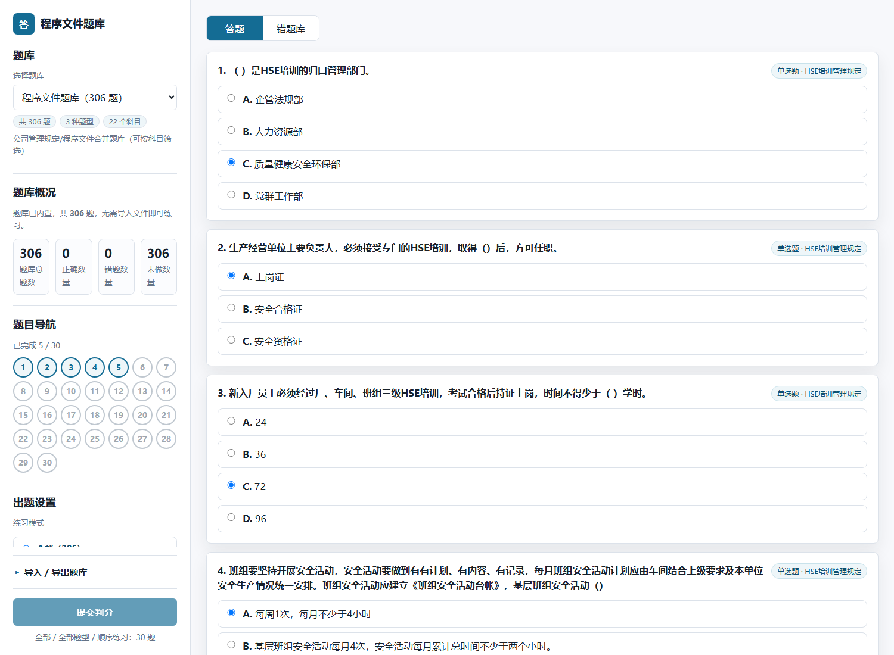
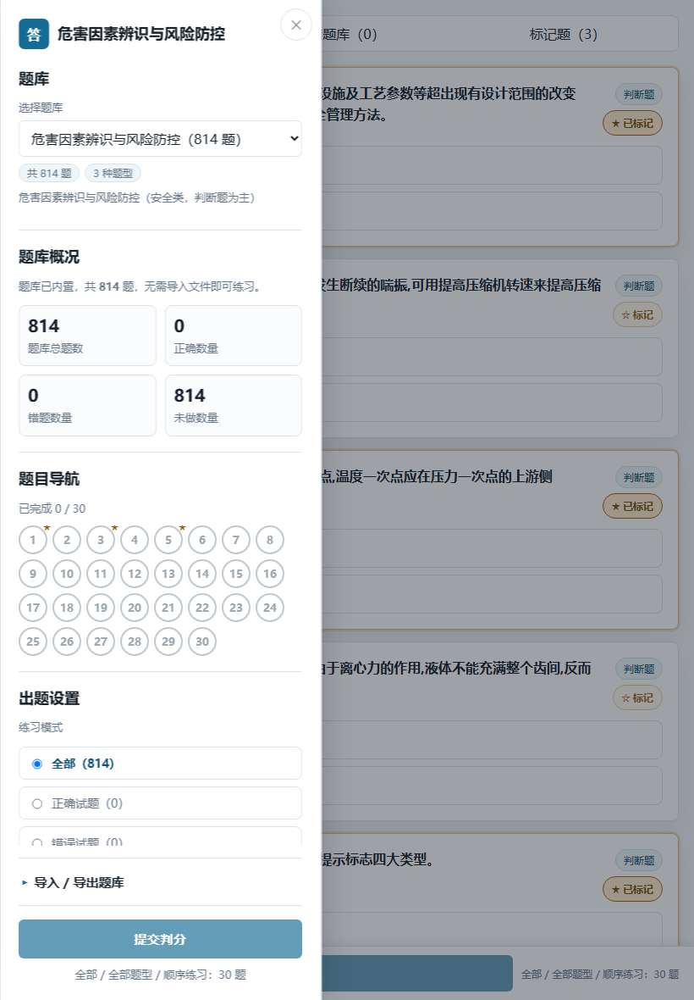

# 乙烯答题练习

把工作区里 5 个各自独立的「离线答题系统」HTML 合并成**一个 App**：打开后左侧选择题库，右侧答题；每个题库的进度、错题、出题设置互相独立。

同一个文件夹有两种用法，内容完全一致：

| 用法 | 怎么打开 | 特点 |
| --- | --- | --- |
| **① Chrome 扩展（侧载）** | 本地「加载已解压的扩展程序」 | 装在浏览器里，点图标即开；离线可用 |
| **② 网页版 / PWA** | 打开网址（如 GitHub Pages），或双击 `index.html` | 手机、任何电脑都能用；可「安装」成独立窗口的应用；离线可用 |

> ⚠️ **GitHub Pages 不能用来装扩展**。Chrome 只允许从本地文件夹「加载已解压的扩展程序」，从网址下载的 `.crx` 会被浏览器拦截（除非公司 IT 用企业策略 `ExtensionInstallForcelist` 白名单推送）。所以 Pages 那条路走的是 **② 网页版/PWA**，体验接近原生应用，但不能替代扩展的安装方式。



## 一、用法 ①：Chrome 扩展（侧载，约 1 分钟）

1. 打开 Chrome，地址栏输入 `chrome://extensions` 回车。
2. 打开右上角的**开发者模式**开关。
3. 点左上角**加载已解压的扩展程序**，选择本文件夹 **`乙烯答题App`**（就是包含 `manifest.json` 的这一层）。
4. 加载成功后浏览器会自动打开答题页；以后点工具栏上的「答」图标即可打开。
   建议点扩展图标右侧的图钉，把它固定到工具栏。

> 加载/更新后如果页面没变化：先在 `chrome://extensions` 里点该扩展的**重新加载**，再刷新答题页。
> （如果之前侧载过旧版，本次入口文件名由 `app.html` 改成了 `index.html`，**必须点一次「重新加载」**。）

扩展 ID 已在 `manifest.json` 里固定为 `ohmbmdmdpcpaakjghmndjgilbcfmfdim`，所以即使把这个文件夹改名、搬到别的位置，Chrome 仍认作同一个扩展，**做题进度不会因为挪动文件夹而丢失**。答题页的固定地址是
`chrome-extension://ohmbmdmdpcpaakjghmndjgilbcfmfdim/index.html`（可存成书签）。

**兜底方案**（公司策略禁用开发者模式、或想用 Edge 时）：
- 直接双击 `index.html` 也能用（纯离线、无远程依赖）。进度存在浏览器本地，与扩展版各存一份。
- 或右键 `index.html` → 打开方式 → Chrome，然后「更多工具 → 创建快捷方式」，勾选「在窗口中打开」，得到类似 App 的窗口。
- Edge 同样支持：`edge://extensions` → 开发者模式 → 加载解压缩的扩展。

## 二、用法 ②：GitHub Pages（网页版 / PWA，推荐给手机和平板）

仓库已经把 `index.html`、web app manifest、Service Worker 都准备好了（本文件夹就是网站根目录），推到 GitHub 后在仓库里开 Pages 即可。

**推送（在能访问 GitHub 的机器上执行，本机需走代理就加 `-c http.proxy=...`）：**

```powershell
cd 乙烯答题App
git remote add origin https://github.com/你的用户名/仓库名.git
git -c http.proxy=http://127.0.0.1:7890 push -u origin main   # 不需要代理时去掉 -c http.proxy=...
```

**开 Pages**：仓库 → Settings → Pages → Source 选 **Deploy from a branch** → 分支 `main`、目录 `/ (root)` → Save。
一两分钟后网址生效：`https://你的用户名.github.io/仓库名/`

**装成应用**：
- 电脑 Chrome/Edge：打开网址 → 地址栏右侧出现「安装」图标，或菜单「更多工具 → 安装为应用」；装好后有独立窗口和开始菜单图标。左侧「题库」里也会出现**安装到桌面 / 手机**按钮。
- 手机：Chrome 菜单 →「添加到主屏幕 / 安装应用」；iOS Safari 用「共享 → 添加到主屏幕」。
- 装好后**断网也能用**：Service Worker 已经把 18 个文件（含 5011 题）缓存到本地。

**更新网页版**：改了 `index.html` / `app.js` / `banks/*` 之后，把 `sw.js` 里的 `const CACHE = "yxa-v1"` 版本号加一，再 push，用户下次打开会自动拿到新版。

> 🔓 **注意**：公开仓库 = 这些题库和答案解析对全网可见且会被搜索引擎收录。若题库属于公司内部资料，请先确认是否可以公开发布；不确定就改用私有仓库（免费账号的私有仓库不能开 Pages）或公司内网服务器（本文件夹整个拷过去即可）。

## 二、内置题库（共 5011 题）

| 题库 | 题量 | 题型 | 说明 |
| --- | --- | --- | --- |
| 危害因素辨识与风险防控 | 814 | 单选 429 / 判断 327 / 多选 58 | 安全类 |
| 程序文件题库 | 306 | 判断 131 / 单选 124 / 多选 51 | 22 个制度，可按**科目**筛选 |
| 认定题库 · 中级 | 1176 | 单选 656 / 判断 520 | 乙烯装置操作工认定题库 |
| 认定题库 · 高级 | 1390 | 单选 591 / 判断 375 / 多选 311 / 简答 72 / 计算 41 | 含主观题 |
| 认定题库 · 技师 | 1325 | 单选 499 / 判断 393 / 多选 291 / 简答 102 / 计算 40 | 含主观题 |

## 三、怎么用

- **选择题库**：左侧「题库」下拉里切换；下拉按分组显示题量。切换后统计、出题、错题库全部跟着换，各题库进度互不影响。
- **科目 / 制度**：程序文件题库会多出一个「科目」下拉（22 个制度），可只练某个制度；其它题库不显示这一项。
- **出题设置**：
  - 练习模式：全部 / 正确试题 / 错误试题 / 未做试题 / **标记试题**（括号里是当前题数）
  - 试题类型：全部 + 当前题库实际存在的题型（含简答、计算等主观题）
  - 试题数量：30 / 50 / 100 / 自定义 / 全部刷完
  - 出题模式：顺序练习 / 随机出题
  - 显示答案：勾选后直接在题目上标出正确选项与解析
  - **添加规则拼题**：把「范围 + 科目 + 题型 + 数量」组合成多条规则（例如「未做 + 判断题 50 题」+「错误试题 + 单选题 20 题」），点「开始出题」按规则一起出题。规则可逐条删除。
- **答题与判分**：选完点右下/底部「提交判分」→ 显示得分、正确率，答错的进「错题库」，没做的保留「未做」状态。判断题显示为「是 / 否」，多选题可多选，简答/计算题是文本输入（需与答案文本一致，标点、空格差异会被忽略）。
- **题目导航**：出题后侧栏出现题号方格，绿=正确、红=错误、灰=未做，**带 ★ 的表示已标记**，点一下跳到该题。
- **错题库**：顶部「错题库」页签浏览错题与正确答案；「清空错题库」把错题退回未做；「全部重置」把当前题库全部退回未做。
- **导入 / 导出题库**（左侧折叠区「导入 / 导出题库」）：
  - 支持 `xlsx` / `xls` / `csv`；按表头识别：`题型`、`题干`（或 `题目内容`）、`答案`、`选项A`~`选项F`（或 `可选项`，用 `;` 分隔）、`解析`/`说明`、`科目`（或 `文件名称`）。
  - 导入的题库作为**新条目**加入题库下拉（可随时「删除此导入题库」），不会覆盖内置题库；同名文件再次导入会提示是否覆盖。
  - 「导出当前题库 JSON」用于备份或转给别人，纯离线。
  - CSV 请用 UTF-8 编码（Excel 另存为「CSV UTF-8」）。

### 平板 / 手机：一个按钮呼出侧栏（不挤压题目）

屏幕宽度 ≤1180px（或触屏设备 ≤1440px，含 iPad 横竖屏、安卓平板、Surface）时会自动进入**抽屉模式**：

- 侧栏默认收起，题目占满整屏、左右不再被挤窄；
- 左下角常驻一个 **「☰ 侧栏」** 小按钮（固定在屏幕底部，滚动刷题时一直在），点它把**整个侧栏**（题库切换、统计、题目导航、出题设置、导入导出）以浮层拉开，背景变暗；
- **点遮罩、点右上角 ✕、按 Esc、点题号跳题、点开始出题/提交判分** 都会自动收起；
- 底部常驻「提交判分」条，不用进侧栏也能交卷。



### 标记题目（自己攒一个重点题库）

- 每道题的**右上角、题型标签正下方**都有一个 **「☆ 标记」** 按钮，点一下变 **「★ 已标记」**，题卡描边变金色；
- 顶部多了一个 **「标记题（N）」页签**，集中查看所有标记题（含正确答案），可直接「取消标记」，侧栏里也有「清空标记」；
- 侧栏「练习模式」多了 **「标记试题」**，可只刷标记过的题，也能配合**拼题规则**用（例如「标记试题 + 判断题 20 题」）；
- 标记是**独立标签**，和正确/错误/未做并存：答错不影响标记，答对了标记也还在；「全部重置」不会清掉标记；
- 标记按题库分别保存，下次打开（含离线）仍在。


## 四、进度保存在哪里

- 全部数据存在浏览器的本地存储里（键名 `yxa:v1:*`，含每个题库的对错记录与**标记**），**不联网、不上传**。
- 换浏览器用户配置、清除浏览数据或卸载会丢失进度；扩展版、Pages 网页版、`index.html` 本地版各自存一份，互不相通（同一个网址下才共享）。
- 原本单文件 HTML 里的旧进度属于 `file://` 来源，**无法迁移**，需要重新开始记录。

## 五、以后要更新题库怎么办

- **换成新的题库文件**：直接用它「导入题库」功能导入即可（不用改代码）。
- **想让新题库变成内置题库**（比如重新导出一份合并题库）：
  1. 把新题库整理成 xlsx/csv，或替换工作区里对应的源 HTML 文件；
  2. 在本文件夹下运行 `python tools\extract_banks.py`，它会重新生成 `banks\*.js` 和 `tools\extract-report.txt`（含每题型的统计与异常清单）；
  3. 到 `chrome://extensions` 点「重新加载」刷新答题页；若已上 Pages，再把 `sw.js` 的 `CACHE` 版本号加一后 push。
- 注意：`banks\*.js` 是脚本自动生成的，不要手工编辑。

## 六、已知限制

- **程序文件题库第 0263 题**：原始题库里答案写的是 `ABCDE`，但只有 A~D 四个选项，属于源数据缺陷。为了不改动原始数据，这里原样保留（该题无法答对），`tools/extract-report.txt` 与校验脚本都会列出来。
- 原始数据里混有 PDF 转换残留的标签（`<p ...>`、`<span ...>`、``）。生成内置题库时已清理：标签去掉、图片占位为「【图】」；另有约 2300 处只是把全角空格等空白归一（与原版 App 渲染时的处理一致）。
- 少数题目在原题库中就是重复题干（技师库 41 组、高级库 10 组、中级库 10 组），其中个别重复题的答案并不一致，均按原样保留。
- 主观题（简答 / 计算）按文本精确匹配判分，只能作为自测；评分标准类题目建议用「显示答案」对照。
- 内置 5 个题库是**快照**：源 HTML 更新后需要重新运行一次生成脚本。
- Pages 网页版第一次打开需要联网（之后离线可用）；扩展版则完全不需要联网。

## 七、目录结构与自检工具

```
乙烯答题App/                    ← 这个文件夹既是扩展目录，也是网站根目录
  manifest.json          扩展清单（MV3，无任何网络权限）
  manifest.webmanifest   PWA 清单（网页版「安装为应用」用）
  background.js          扩展：点图标 → 新标签页打开答题页；首次安装自动打开一次
  index.html             页面入口（扩展与网页版共用）
  app.css  app.js        界面与全部答题逻辑（脚本外置，无 eval，满足扩展页 CSP）
  sw.js                  Service Worker：18 个文件离线缓存
  pwa.js                 网页版注册离线缓存 + 「安装到桌面/手机」按钮（扩展页自动跳过）
  .nojekyll  .gitignore  发布与版本管理用
  banks/index.js         题库顺序与元信息
  banks/wf.js cx.js rd-zj.js rd-gj.js rd-js.js   自动生成的题库数据
  vendor/xlsx.full.min.js   SheetJS 0.20.2（本地副本，导入 xlsx/xls 用；Apache-2.0，版权归 SheetJS LLC）
  icons/                 图标（16/48/128 扩展用；192/512/512-maskable PWA 用）
  tools/extract_banks.py    从源 HTML 生成 banks/*.js
  tools/verify_banks.mjs    静态校验：题号唯一、答案与选项匹配、无残留标签、CSP/离线清单/密钥泄漏
  tools/smoke_test.mjs      运行时冒烟测试：启动/出题/判分/切库/清错题/重开保留进度/导入 xlsx+csv
  tools/make_icons.py       生成全部图标
  tools/extract-report.txt  最近一次题库生成的统计与异常清单
```

自检命令（需要 Node 与 Python，本机调试用，日常使用不需要）：

```powershell
cd 乙烯答题App
node tools\verify_banks.mjs     # 题库、页面、离线清单、密钥泄漏 静态校验
node tools\smoke_test.mjs       # 完整流程冒烟测试
python tools\extract_banks.py   # 重新生成题库（源 HTML 有更新时）
python tools\make_icons.py      # 重新生成图标
```

> 上一级目录里的 `乙烯答题App-扩展密钥.pem` 是这个扩展的自签名私钥（扩展 ID 由它决定），**故意放在本目录之外、且已被 `.gitignore` 排除**，不会随仓库公开。
> 只有在需要重新打包成 `.crx`（`chrome.exe --pack-extension=... --pack-extension-key=...`）时才会用到；平时侧载不需要它。
